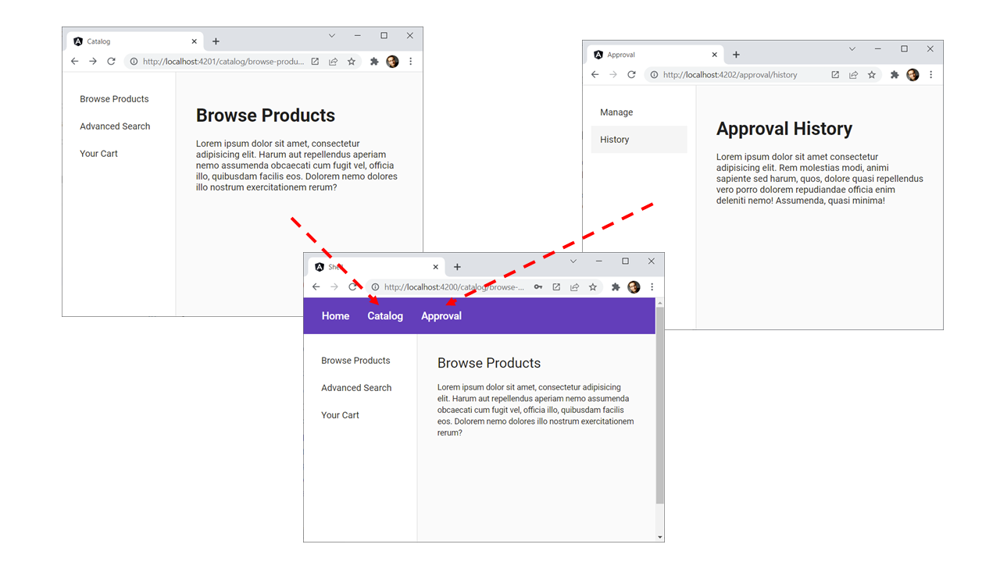

# Show Case for Building Micro Frontends with Angular, the CLI, and Module Federation

This show case contains a shell loading two micro frontends called catalog and approval on demand via module federation. These three applications are part of a CLI workspace and built separately. This allows different teams to work on these applications more **autonomously** and **improves build times**:



## Start

```
npm i
npm run run:all
```